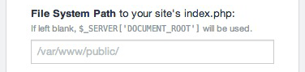

## Minimee for Craft - v0.7.4

A [Craft CMS](http://buildwithcraft.com) port of the popular [Minimee](https://github.com/johndwells/Minimee) add-on for ExpressionEngine.

---

Minimize, combine & cache your CSS and JS files. Because size (still) DOES matter.

* [On github](https://github.com/johndwells/craft.minimee)
* [Support](https://github.com/johndwells/craft.minimee/issues)

---

## Features

* Config settings will parse [Environment Variables](http://buildwithcraft.com/docs/multi-environment-configs#environment-specific-variables)
* Use as a [Twig Filter](http://twig.sensiolabs.org/doc/tags/filter.html) or [Craft Variable](http://buildwithcraft.com/docs/plugins/variables)
* Enable/disable minification of CSS & JS
* Enable/disable combination of CSS & JS
* When in `devMode`, Minimee will throw `Exception`s if unable to run successfully
* When in `devMode`, will automatically attempt to clean up what it can determine are expired caches
* Override CP Settings via filesystem config (requires Craft 1.4)

## Installation

1. Download latest release from [github](https://github.com/johndwells/craft.minimee/releases)
2. Unzip and rename folder to `minimee`
3. Copy `minimee` into your `app/plugins` directory
4. Log into Craft and go to `Settings > Plugins`
5. Click `install` for Minimee
6. Visit Minimee plugin settings and optionally configure (see below)

## Configuration (optional)

### Step 1: Help Minimee finds your assets

By default, Minimee takes the path to your local asset (e.g. `/asset/css/normalize.css`), and appends this to `$_SERVER['DOCUMENT_ROOT']`. This tends to work for 99% use cases; however if your setup is such that your local assets are not at your webroot, or if your server does not correctly report the value for `DOCUMENT_ROOT`, then you can specify what value it should be.

### Step 2: Tell Minimee where to generate the cache

By default, Minimee stores cached assets in Craft's `craft/storage` folder, which likely sits above webroot. The cache is then delivered by Craft itself, via a special "resource" url, e.g. `http://domain.com/resources/minimee/filename.timestamp.ext`.

Alternatively, you can specify a cache path & URL which sits _below_ webroot, so that the cached assets are delivered directly by your server. This is the recommended setup for optimal performance gains.

> Note that all settings will parse global [Environment Variables](http://buildwithcraft.com/docs/config-settings#environmentVariables).

## Debugging

When your site is running in [devMode](http://buildwithcraft.com/docs/config-settings#devMode), Minimee will throw an `Exception` containing any messages which indicate where an error may have occurred.

Also while in devMode, Minimee will continually try to clean your cache folder of what it can safely determine are expired caches.

## Usage

There are currently two ways you can use Minimee:

1. Template Variable

2. Twig Filter

### 1. Template Variable

Minimee's template variable is attached to Craft's global variable `{{ craft }}`, and accessed via `{{ craft.minimee.css() }}` and `{{ craft.minimee.js() }}`. An array of asset paths is passed to each variable, with a second optional parameter containing an array of settings.

##### CSS:

	{{ craft.minimee.css([
			'/assets/css/normalize.css',
			'/assets/css/app.css'
		])
	}}
	
	{# Optionally pass settings as 2nd parameter #}
	{{ craft.minimee.css([
			'/assets/css/normalize.css',
			'/assets/css/app.css'
		], {
			'filesystemPath' : craft.config.environmentVariables['filesystemPath']
		})
	}}

##### CSS:

	{{ craft.minimee.js([
			'/assets/js/jquery.js',
			'/assets/js/app.js'
		])
	}}
	
	{# Optionally pass settings as 2nd parameter #}
	{{ craft.minimee.js([
			'/assets/js/jquery.js',
			'/assets/js/app.js'
		], {
			'enabled' : craft.config.environmentVariables['minimeeEnabled']
		})
	}}

### 2. Twig Filter

Minimee can also be used as a [filter](http://twig.sensiolabs.org/doc/tags/filter.html), providing the ability to parse and process complete HTML tags, similar to how Minimee operates as an EE plugin.

Minimee can detect which type of asset to process; you may optionally pass an array of settings to any filter.

#### CSS:

	
		<link href="/assets/css/normalize.css'" />
		<link href="/assets/css/app.css'" />
	
	
	{# Optionally pass settings as parameter #}
	

	
		<link href="/assets/css/normalize.css'" />
		<link href="/assets/css/app.css'" />
	
		
#### JS:

	
		
		
	

	{# Optionally pass settings as parameter #}
	
	
	
		
		
	

#### `{{ getHeadHtml }}` & `{{ getFootHtml }}`:

The `filter` will also work in conjunction with Craft's [getFootHtml](http://buildwithcraft.com/docs/templating/functions#getFootHtml) and [getHeadHtml](http://buildwithcraft.com/docs/templating/functions#getHeadHtml) tags.

	
	
    {{ getHeadHtml() | minimee }}

	
	
    {{ getFootHtml() | minimee }}

	{# Optionally pass settings as parameter #}
	
    {{ getHeadHtml() | minimee(minimeeSettings) }}
    {{ getFootHtml() | minimee(minimeeSettings) }}

> **Note that any inline CSS or JS passed via ``, `` and`` is currently not supported.**

## Roadmap - 1.0 release

* allow settings via config file
* improve/refactor internal abort()
* all messages/instructions translatable
* unit test?

## Roadmap - post 1.0 release

* tie the cache hash to settings and/or last date modified of settings/config and/or minimee version?
* support [includeJs](http://buildwithcraft.com/docs/templating/tags#includeJs), [includeCss](http://buildwithcraft.com/docs/templating/tags#includeCss) and [includeHiResCss](http://buildwithcraft.com/docs/templating/tags#includeHiResCss)?
* make tag template configurable
* improved logging
* additional hooks/events
* option to return cache filename only
* run validation while saving settings
* try to resolve URL assets to local assets
* give CP ability to clear cache

## Unit Test All The Things

### Assert that:
* a CSS URL is rewritten even when CSS minification is disabled
* CSS/JS are not combined when combineCssEnabled / combineJsEnabled is off
* CSS/JS are not minified when minifyCssEnabled / minifyJsEnabled is off

## License

[http://opensource.org/licenses/mit-license.php](MIT License)
