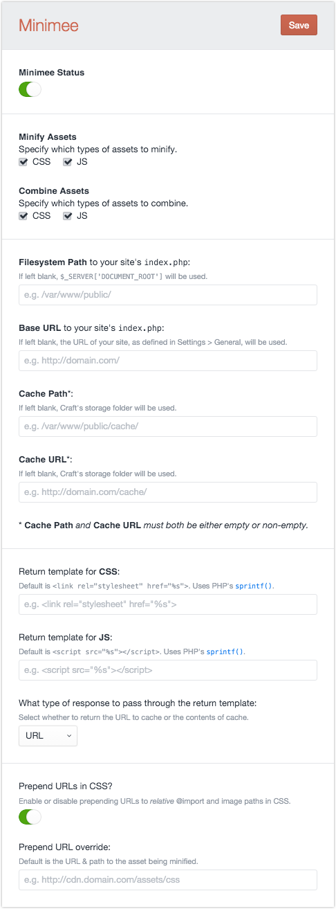

# Minimee for Craft - v0.8.3

A [Craft CMS](http://buildwithcraft.com) port of the popular [Minimee](https://github.com/johndwells/Minimee) add-on for ExpressionEngine.

---

Minimize, combine & cache your CSS and JS files. Because size (still) DOES matter.

* [On github](https://github.com/johndwells/craft.minimee)
* [Support](https://github.com/johndwells/craft.minimee/issues)

---

## Features

* Config settings will parse [Environment Variables](http://buildwithcraft.com/docs/multi-environment-configs#environment-specific-variables)
* Use as a [Twig Filter](http://twig.sensiolabs.org/doc/tags/filter.html) or [Craft Variable](http://buildwithcraft.com/docs/plugins/variables)
* Can save caches either above or below webroot
* Enable/disable minification of CSS & JS
* Enable/disable combination of CSS & JS
* When in `devMode`, Minimee will throw `Exception`s if unable to run successfully
* When in `devMode`, will automatically attempt to clean up what it can determine are expired caches
* Override CP Settings via filesystem config (requires Craft 1.4), or at runtime

---

## Installation

1. Download latest release from [github](https://github.com/johndwells/craft.minimee/releases)
2. Copy `minimee` into your `app/plugins` directory
3. Log into Craft and go to `Settings > Plugins`
4. Click `install` for Minimee
5. Visit Minimee plugin settings and optionally configure (see below)

---

## Settings

Out of the box and when first installed, Minimee will be automatically enabled and set to combine & minify both your CSS and JS assets. It will use default settings to get you up and running immediately, but you can visit the `Settings` page of the plugin to configure to suit your environment.

> Note that all settings will parse Craft's [Environment Variables](http://buildwithcraft.com/docs/config-settings#environmentVariables).

##### Filesystem Path

To locate your assets on your web server, Minimee takes the path to the asset (e.g. `/asset/css/normalize.css`), and appends this to `$_SERVER['DOCUMENT_ROOT']`. This tends to work for most setups, and can be left as is.

However for a multi-lingual site, where you may have many `index.php` files (and therefore differing values of `$_SERVER['DOCUMENT_ROOT']`), but one location of CSS and JS assets, you will want to specify that singlular path location. This is when using Craft's [Environment Variables](http://buildwithcraft.com/docs/config-settings#environmentVariables) might particularly come in handy.

##### Base URL

When operating upon your CSS, Minimee needs to rewrite the paths to images & fonts, so that the cached file can still successfully link to those images & fonts, no matter where it may be saved. By default, the URL of your site is used, as defined in **Settings > General**.

Similar to the `Filesystem Path`, this may need to be overriden in certain circumstances. In fact it's probably safe to say that if you need to override the Filesystem Path, you will want to also override the Base URL accordingly.

##### Cache Path & URL

By default, Minimee stores cached assets in Craft's `craft/storage` folder, which likely sits above webroot. The cache is then delivered by Craft itself, via a special "resource" url, e.g. `http://domain.com/resources/minimee/filename.timestamp.ext`.

Alternatively, you can specify a cache path & URL which sits _below_ webroot, so that the cached assets are delivered directly by your server. This is the recommended setup for optimal performance gains.

### Runtime Settings

In addition to specifying configuration settings via the CP, you can also pass an array of settings when calling any of Minimee's tags below. For example, you can create this simple [Twig hash](http://twig.sensiolabs.org/doc/templates.html#literals), and then pass it as a parameter to either of Minimee's template tags:

	{#
		Tip: In your template you can access Craft's environment Variables like so:
		craft.config.environmentVariables['variableName']
	#}

	{% set minimeeSettings = {
		'enabled' : true,
		'combineCssEnabled' : true,
		'combineJsEnabled' : true,
		'minifyCssEnabled' : true,
		'minifyJsEnabled' : true,
		'filesystemPath' : '/var/www/public/',
		'baseUrl' : 'http://craft.dev/',
		'cachePath' : '/var/www/public/cache/',
		'cacheUrl' : 'http://craft.dev/cache/',
		'cssTagTemplate' : '<link rel="stylesheet" href="%s">',
		'jsTagTemplate' : ''
	} %}

### Filesystem Config Settings

As of Craft 2.0, Minimee supports the ability to override the CP Settings with filesystem configs. Note that this does NOT reduce any processing/DB overheads, but it may suit how you prefer to configure Minimee across multiple environments.

To use this feature, begin by copying the contents of the `minimee/config.php` file into a new file named `minimee.php`, and move it to your `craft/config` folder. Then uncomment and set as few or as many settings as you wish.

For more on how multi-environment configs work in Craft, see [http://buildwithcraft.com/docs/multi-environment-configs](http://buildwithcraft.com/docs/multi-environment-configs).

### The Settings "Cascade"

Given all of the ways to configure Minimee, keep in mind the the cascade or inheritance of these methods:

* CP settings are defaults
* Filesystem settings override CP settings
* Runtime settings override Filesystem settings

_When overriding via any method, you only need to specify those setting values which need to be different._

---

## Debugging

When your site is running in [devMode](http://buildwithcraft.com/docs/config-settings#devMode), Minimee will throw an `Exception` containing any messages which indicate where an error may have occurred.

Also while in devMode, Minimee will continually try to clean your cache folder of what it can safely determine are expired caches.

---

## Usage

There are currently two ways you can use Minimee:

1. Template Variable

2. Twig Filter

_Both methods can be passed an optional parameter of runtime settings. Refer to the section above on how to define these._

### 1. Template Variable

Minimee's template variable is attached to Craft's global variable `{{ craft }}`, and accessed via `{{ craft.minimee.css() }}` and `{{ craft.minimee.js() }}`. An array of asset paths is passed to each variable, with a second optional parameter containing an array of settings.

##### CSS:

	{{ craft.minimee.css([
			'/assets/css/normalize.css',
			'/assets/css/app.css'
		])
	}}
	
	{# Optionally pass settings as 2nd parameter #}
	{{ craft.minimee.css([
			'/assets/css/normalize.css',
			'/assets/css/app.css'
		], minimeeSettings)
	}}

##### CSS:

	{{ craft.minimee.js([
			'/assets/js/jquery.js',
			'/assets/js/app.js'
		])
	}}
	
	{# Optionally pass settings as 2nd parameter #}
	{{ craft.minimee.js([
			'/assets/js/jquery.js',
			'/assets/js/app.js'
		], minimeeSettings)
	}}

### 2. Twig Filter

Minimee can also be used as a [filter](http://twig.sensiolabs.org/doc/tags/filter.html), providing the ability to parse and process complete HTML tags, similar to how Minimee operates as an EE plugin.

Minimee can detect which type of asset to process; you may optionally pass an array of settings to any filter.

#### CSS:

	
		<link href="/assets/css/normalize.css'" />
		<link href="/assets/css/app.css'" />
	
	
	{# Optionally pass settings as parameter #}
	
		<link href="/assets/css/normalize.css'" />
		<link href="/assets/css/app.css'" />
	
		
#### JS:

	
		
		
	

	{# Optionally pass settings as parameter #}
	
		
		
	

#### `{{ getHeadHtml }}` & `{{ getFootHtml }}`:

The `filter` will also work in conjunction with Craft's [getFootHtml](http://buildwithcraft.com/docs/templating/functions#getFootHtml) and [getHeadHtml](http://buildwithcraft.com/docs/templating/functions#getHeadHtml) tags.

	
	
    {{ getHeadHtml() | minimee }}

	
	
    {{ getFootHtml() | minimee }}

	{# Optionally pass settings as parameter #}
	
    {{ getHeadHtml() | minimee(minimeeSettings) }}
    {{ getFootHtml() | minimee(minimeeSettings) }}

> **Note that any inline CSS or JS passed via ``, `` and`` is currently not supported.**

---

## Roadmap - 1.0 release

* improve/refactor internal abort()
* all messages/instructions translatable
* improved logging
* validation during settings save
* ensure using best practice for method names
	* setX, getX
	* isX
	* doX
	* useX
	* protected has leading underscore?	
* unit test
* remove use of GLOBALS in preference of pathsService

### Roadmap - post 1.0 release

* create `*.gz` versions of cache, for serving precommpressed files automatically via [Apache](https://blog.jcoglan.com/2007/05/02/compress-javascript-and-css-without-touching-your-application-code/) or [nginx](http://wiki.nginx.org/HttpGzipStaticModule).
* publish "map" js files during development
* tie the cache hash to settings and/or last date modified of settings/config and/or minimee version?
* support [includeJs](http://buildwithcraft.com/docs/templating/tags#includeJs), [includeCss](http://buildwithcraft.com/docs/templating/tags#includeCss) and [includeHiResCss](http://buildwithcraft.com/docs/templating/tags#includeHiResCss)?
* additional hooks/events
* option to return cache filename only
* try to resolve URL assets to local assets

---

## Unit Test All The Things

Unit Testing of this plugin is in active, sporatic, trial-and-error development. If you see anything that can improve this process, I'd welcome your thoughts.

**Minimee's Unit Tests can be found on Minimee's [development branch](https://github.com/johndwells/craft.minimee/tree/development).**

### Running Minimee's Tests

To run Minimee, the following assumptions are made:

* you have PHP 5.3+ available to run from CLI
* optionally xdebug is configured for PHP if you'd like run PHPUnit's **coverage reports**.
* composer is installed globally (if installed locally, the commands below may have to be adjusted)
* you have a local copy of Craft running

With the assumptions taken care of, these steps should get you up and running: 

1. Fork, clone or download the `development` branch of Minimee
2. In terminal, `cd` to `minimee/tests`
3. Run `composer install --dev`
1. Run `php vendor/bin/phpunit --bootstrap /path/to/your/craft.dev/craft/app/tests/bootstrap.php`, taking care to update the path accordingly.

_Note that for testing, it's not necessary to have Minimee installed, nor even located in your Craft's plugins folder._

---

## License

[http://opensource.org/licenses/mit-license.php](MIT License)
